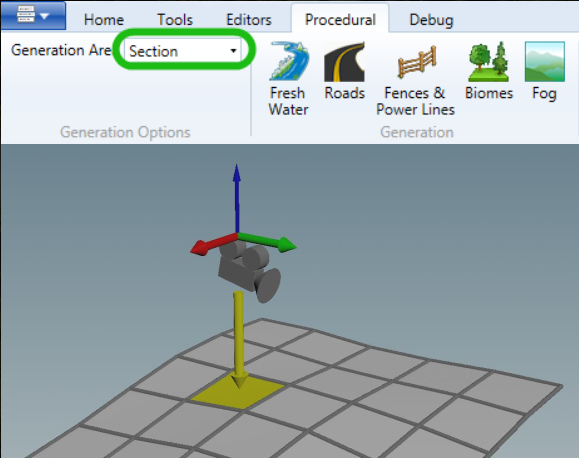
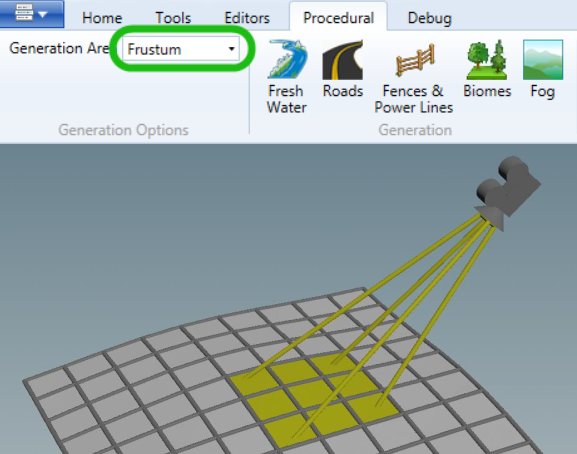
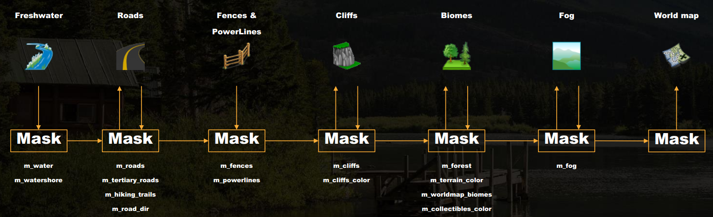
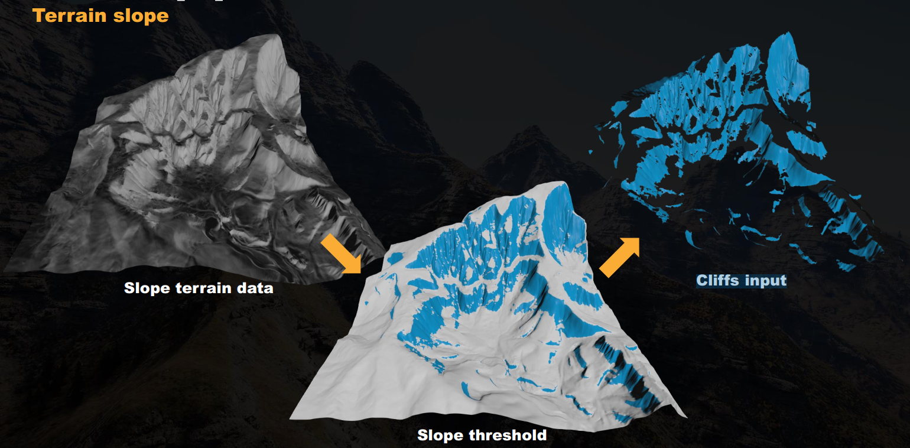
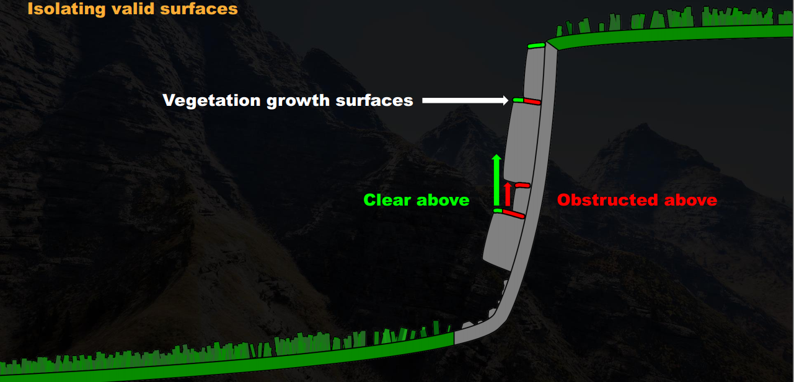
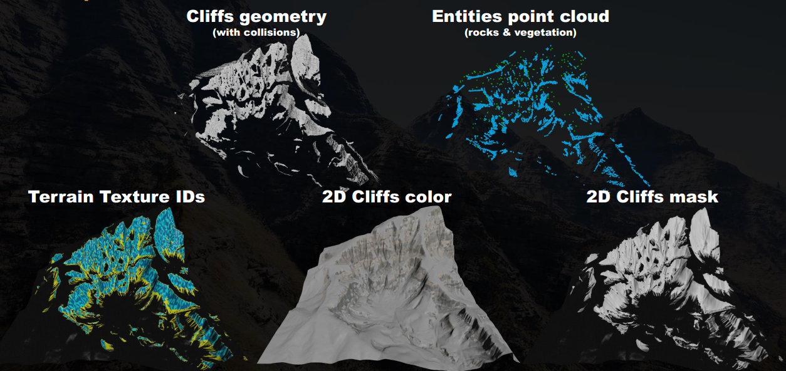
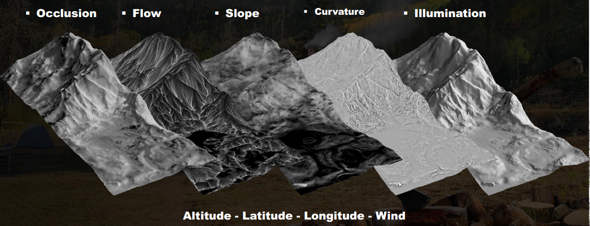

## 2- GOAL OF THE PIPELINE
- 1st objective : Fill up the world（最基础的目标）
- 2nd objective : Consistent with terrain topology（适应地形变化）
- 3rd objective : Automated（保证不同的机器可以在夜晚不间断生成世界不同部分，保证用户每天早上更新世界数据）
- 4th objective : Deterministic（保证给定相同输入的情况下，不同构建机器可以得到相同结果）
- 5th objective : User friendly（为用户提供编辑工具，方便用户管理、使用）

## 3- THE TOOLS
- Freshwater
- Fences & Powerlines
- Cliffs
- Biomes
- Fog
- Worldmap

## 4- USERS POINT OF VIEW

### 4.1 Terrain
用户使用Dunia编辑工具改变地形

### 4.2 Freshwater
将curves and spline （曲线与样条）作为freshwater工具的输入，我们可以直接通过样条spline的宽度控制河流。

### 4.3 Cliffs
生成悬崖网格及地形纹理。

该工具简单的基于地形陡度，用户只需要在期望的地形上运行生成。

### 4.4 Biomes
用户可以使用biomes工具生成想要的生物群落。

### 4.5 Points of Interest
#### Adding a road
添加人类对环境的影响。如用road spline添加道路。

在烘烤道路工具之后，用户可以刷新biomes工具以清除道路上的植被。

#### Setup a location
为了自定义位置，用户可以通过绘制像草一样的子生物群落并添加丛林来覆盖主要生物群落。 这将清除铺设建筑物等的方式。

### 4.6 Fences
fence工具的输入依然是spline，用户只需在样条参数上设置他想要生成的栅栏类型并运行生成。

### 4.7 Power lines

## 5- THE PIPELINE
使用可用的输入输出实现houdini与dunia之间的数据传输。

### 5.1 Input
From Dunia to Houdini:
- 一些输入通过python脚本从Dunia发送到Houdini

  - World information
  - File Paths
  - Terrain sectors
  - Splines and Shapes

- 其他输入只是在磁盘上提取，可以使用Dunia提供的文件路径从Houdini读取

  - Height maps (.raw)
  - Biome painter (.png)
  - 2D terrain masks (.png)
  - Houdini Geometry (.geo or .bgeo)

**Terrain是主要输入。**

### 5.2 Baking Procedural
Generation Area：
- All (编辑器中加载的所有地形)
- Map (1024m x 1024m) (位于编辑器中相机下方部分)
- Section (256m x 256m) (位于编辑器中相机下方部分)
- Sector (64m x 64m) (位于编辑器中相机下方部分)
- Frustum (相机可见的所有扇区)

 

### 5.3 Outputs
From Houdini to Dunia:
- Entity point cloud
- Terrain texture layers
- Terrain height map layers
- 2D terrain data (RGB or grayscale)
- Geometry (procedurally generated)
- Terrain Logic zones (用于环境预设和后期处理)

### 5.4 Entity Point Cloud
可以是在编辑器中具有位置的任何类型的对象。
- Vegetation assets
- Rocks
- Collectibles
- Decals
- VFX
- Prefabs
- etc

### 5.5 Tools interconnectivity
每个工具都会输出必要的masks影响下一个工具。
如果一个工具需要输入前一个工具的结果，顺序将很重要。

## 6- THE CLIFF TOOL
### 6.1 Start up point
Slope terrain data->Slope threshold->Cliffs input

### 6.2 Preparing geometry
Remeshing: 由于地形网格在斜坡处会被拉伸，所以我们通过重新划分几何来获得均匀的三角形。

### 6.3 Geological Stratification（地质分层）
在cliffs工具中重现自然现象。如由过去的沉积岩和土壤形成的可见水平线。

#### Stratification
- 要创建分层效果，我们有一个工具可将输入几何切片为分层块；
- 每个层具有随机厚度，并为每个切片分配一个层ID，我们可以使用它来为层添加随机颜色。

#### Strata angle
RGB input（这个地方不是很清楚）

#### Split noise
打破分层线：

地层线条过于完美和不自然，因此我们会加入噪音，打破它们并带来混乱。
噪声在较低分辨率的网格上生成，并传输到雇用网格，以获得更大和更块状的模式。<u>（为什么是在低分辨率网格上生成？）</u>

#### Split geometry
悬崖表面根据噪音被分为两组。

#### Stratification
创造地质层：

分层工具在具有不同种子值的两个组上运行以分解我们的分层线。

### 6.4 Geometry shapes
#### Shape
挤压和位移:

每个地层以不同的厚度挤出，并使用displacement maps的组合移位。

#### Optimizing geometry
减少三角形数量。

#### Split for export
几何被划分为扇区。每个颜色代表一个不同的扇区和一个用于导出的单个网格。

### 6.5 Shading
- 无需UV
- X Y Z纹理投影
- X&Y具有每个纹理的投影角度设置（高程和旋转）
- 拾取地形纹理ID和颜色

### 6.6 Cliffs terrain data
Cliffs网格属性转移回地形。

### 6.7 Cliffs terrain color
从我们刚刚转移的strata属性，我们首先生成一个颜色层，它将在世界中创建一个宏观色调变化。

### 6.8 Cliffs Erosion
流动模拟：

从我们转移到地形的cliff mask，我们通过运行流动模拟进一步扩展悬崖。 散落在悬崖表面上的点将沿着斜坡流下以产生侵蚀效果。 原始地层颜色保留在侵蚀区域。

#### Crumbled rocks
碎石散落在侵蚀面上

#### Terrain texture
从地形masks生成悬崖地形纹理ids。

### 6.9 Vegetation growth surfaces
悬崖表面可以有植被生长，但具有分离的有效表面。

### 6.10 Export
编辑器导出的数据：

## 7- THE BIOME TOOL

### 7.1 Generate Terrain Abiotic Data (非生物数据)

从disk读取2D地形属性数据（PNGs）：

- 生物群落图
- 程序化生成的数据：Freshwater masks、Roads masks、Fences mask、Power lines mask、Cliffs mask 

### 7.2 Process Main Biomes 

主要生物群系将自动处理，而亚生物群系基于非生物地形数据。

主要生物群系还处理其他奇特的事情，例如在用户放置电源线的位置用草地替换森林。

### 7.3 Sub-Biomes Recipes

 

#### Generate terrain entities 

- 地形上的分散实体（点云）
- 修改和创建地形属性
- 确定每个物种的生存能力

### 7.4 Viability (生存能力)

通过为每个物种设置有利的地形属性来定义生存能力。积累最大生存能力的物种将胜出。

（viability设定具体看PDF文档P77）

#### 结合viability radius选择胜出物种

当viability低的物种位于viability高的物种的viability radius范围内时，将被丢弃。

#### Priority Radius 

如果有优先级，将首先处理优先级。如果优先级相同则使用生存能力代替。

<u>（这个地方的图文没看懂）</u>

### 7.5 Combine terrain data 

自然界中存在一些现象，如陡坡上的流线上、山脉的南面几乎没有植被生长。为了得到相似的现象，我们通常会将不同的非生物地形数据结合起来。

将上面得到的两个结果结合：

#### Noises

通常通过在地形数据中加入噪声来产生额外的混乱。

#### Exclusion masks 

加入以前工具（如淡水，道路或悬崖）产生的各种排除面具。

最后的结果将作为物种生存能力。结合地形数据是生物群落生成工作流程的核心。 通过混合各种地形属性，我们可以为物种分布创建非常特定的模式，并积累波动的生存能力，有助于将各种物种有机地混合在一起。

### 7.6 Sizes

现在我们的工具可以处理同一物种的多种尺寸。

#### Size of trees 

观察自然界，可以发现：

1. 影响树大小的因素有很多；
2. 小/幼树往往会分布在森林边缘；
3. 高大/古老的树木将更多地存在于大型森林中心。

#### 海拔对size的影响

通常海拔越高，size越小。

#### 不同size资产

我们将资产规模大小选择与生存能力结合。

如设置size=1 对应 meters = 50米；size=2 对应 meters = 40米；size=3 对应 meters =30米......

每个尺寸都放在地形上适当的生存范围内。

这将在森林边界产生一个很好的逐渐减少的效果。
然而，也会带来一个问题，即楼梯效应。

### 7.7 Scale

Scale百分比用来弥补不同size的差距。

#### Sizes Variation

几个相同大小的资产，每种变化的概率控制。（如一种植物的死亡形式及生长形式）、

#### Forest Canopy （森林冠层）

**Ecological succession**

正如我们之前看到的那样，幼树往往会生长在森林的边缘，而旧的树将更深入内部。 但是在森林里也可能有年轻的再生树。
我们怎样才能做到这一点？
我们看到了可行性如何影响树大小选择。
<u>（没看明白）</u>

### 7.8 Age 

根据所使用的地形数据，我们并不总是在生存能力上得到平滑的梯度。 例如，这可能导致我们的最高树木在森林边缘。
出于这个原因，我们添加了“age”参数，该参数基本上是从生存能力生成的带符号距离字段。

用Age代替生存能力做size选择。

我们可以控制年龄对大小选择的影响；调整年龄最大距离可以让我们控制森林边界的深度。

#### 7.9 Density

#### Ramp from size

smallest size 对应高密度，largest size 对应低密度。

#### Slope aspect effect on density

可以用地形数据，如光照(坡度)来直接影响密度。

### 8、Color

通常植物会有很多颜色。

#### 每个实例的颜色变化

利用水符号距离场mask来驱动这些草的颜色变化。

### 9、Rotation

#### 9.1 Orient on terrain slope 基于地形坡度

分散的实体也需要有自己特定的旋转。
默认情况下，它们的前进轴朝向地形坡度。

#### 9.2 Grass leaning towards water example 草倾向水长的例子

因为资产前轴是面向地形坡度的，这草资产将永远倾向于水。

#### 9.3 Bended tree trunks example 弯曲树干的例子

斜坡上的树干下部总是正确的朝向地形坡度。

#### 9.4 Orient on wind vector map 基于风矢图确定方向

其他像麦草这样的资产是在风矢量图上定向的。

风图是根据总体风向绘制的，但也会根据地形形状略有波动。当风吹向小山时，它会倾向于绕着小山流动。