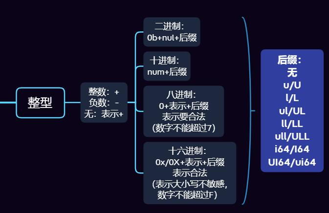

# CPP宏定义文件解析

1. 注释用自动机拆

2. float的坑：
   后缀的f,F,l,L处理
   float是可以不带小数点的，这个时候e必须存在
   小数点前后的数字可以省略，但不能两个都没有
   符号+和-，符号和数字中间可能有空格

   例如1e-6, 1E+6, .75e2, 4.E1之类都是合法的

3. int类型转换

   这里不需要二进制，后缀还有LU和LLU的情况。同时注意：

   1）前缀的大小写有注意吗
   2）进制方面处理了哪些后缀
   3）有没有和float混淆
   4）符号位处理有没有考虑空格

   

4. float转换

   l L f F e E 空格 \t + -号

   e后面也可能有正负号

